# SMS Collection Spam Dataset

The dataset provides some information about the mail, including his content. The goal is there to classify it as a spam or not.

## a) Data Preparation

 

- We read the file and create the dataframe, changing ham and spam in 0/1
- We create a column using the word selecting the word of more than 3 letters
- We create 2 and 3 grams
- We count the words
- We process the Hashing Term Frequency of the 3 useful columns (words, 2gram &amp; 3gram)
- We create IDF of those 3 columns

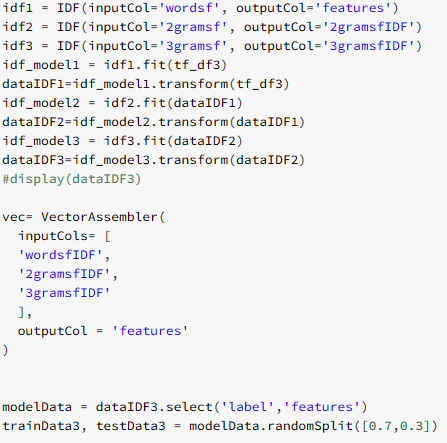 

- We create the vector selecting the 3 important column
- We split our data between train and test (70% / 30%)

Results:

(before the Hashing and IDF)

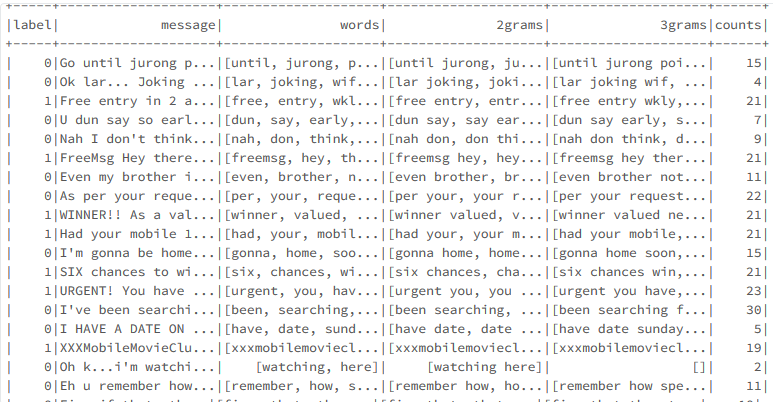 

We build another testSet to try on other models, this one will use Count Vectoriser:

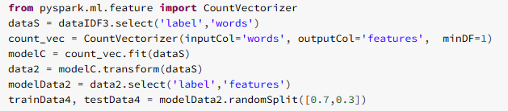 

## b) Building our models

We first begin with a linear model (not asked, done to test):

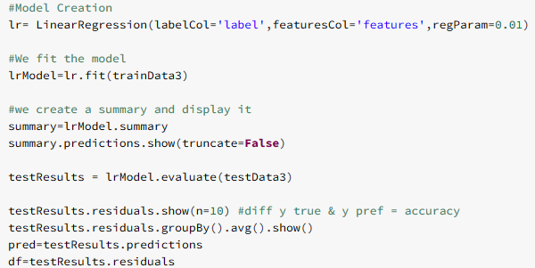 

Result:

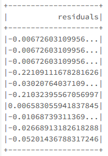 

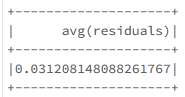 

The results seems pretty coherent so we look at the predictions

 

 

Predictions:

- As we can see the prediction for 0 is quite close from 0 and the ones also close to 1, but this kind of model is not really adapted for this kind of use, that&#39;s why we will test other ones

*Logistic Regression*:

 

- Same as always, we fit our model, fit it and evaluate our performances

*Results*:

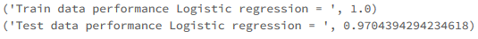 

- As we can see our model predict really well

*Naïve Bayesian*:

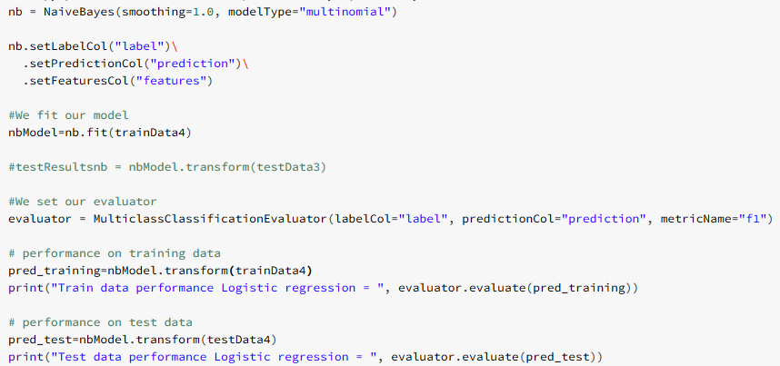 

- We create our model, fit it and evaluate our performances

Results:

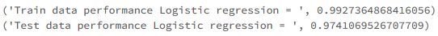 

- As we can see this model seems really close to the logistic regression

*Decision Tree*:

- We create our mode, fit it and evaluate our performances

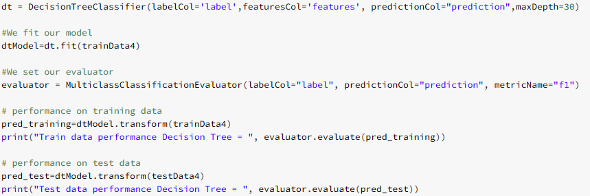 

Results:

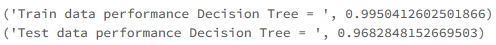 

- Even though the performances are really good, this king of model have the poorest performances until now

*Random Forest*:

- We create our mode, fit it and evaluate our performances

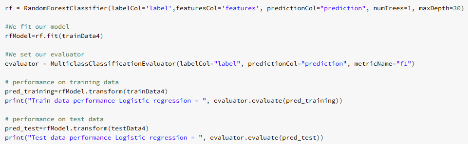 

Results:

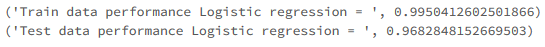 

- The results are close to the decision tree, so not the best one

## c) Cross validation &amp; ParamGridBuilder

To improve one of our model, we decided to use Cross validation and paramGridBuilder to choose the best parameter among the list given.

We will try to improve our model but also to find which one of the 2 generated train / test set is the best

**With the TF-IDF column** :

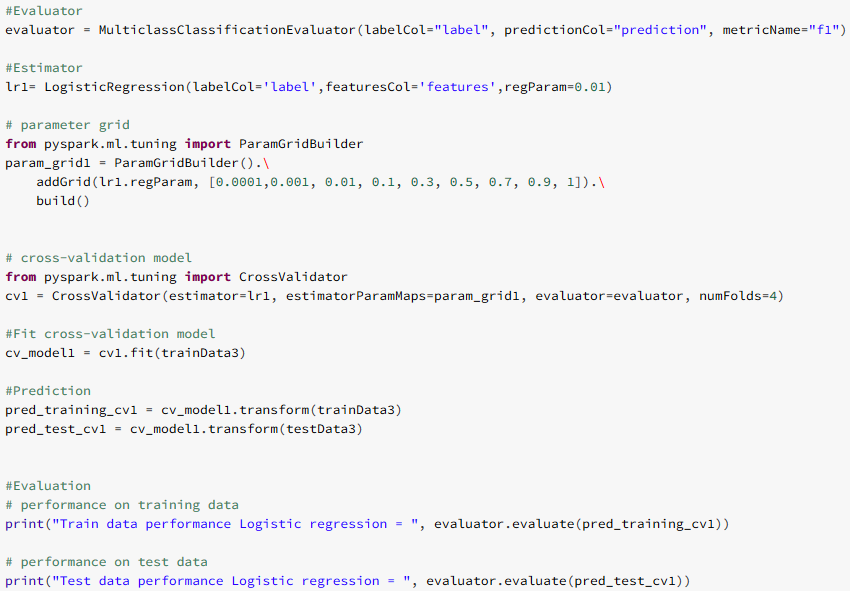 

- We create the model
- We create our parameter grid which will try different regression parameters (9 of them)
- Then we add them to our cross validator previously set
- We fit our model and see our results

Results:

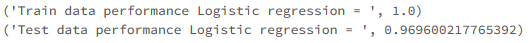 

**With the Count Vector column**

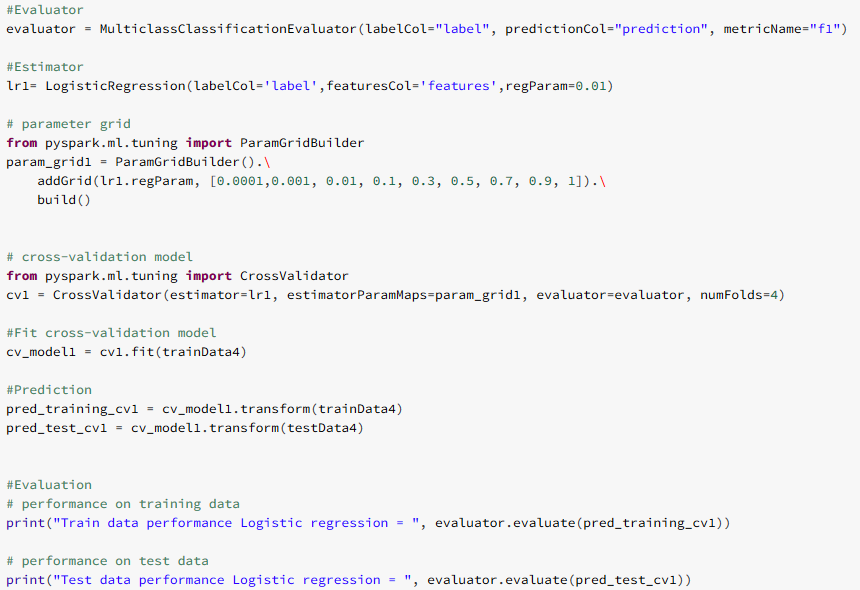 

Results:

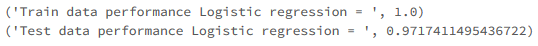 

- As we can see the results are better with the data coming from the count Vector
- Doing the cross validator helped us to go from 0.9704394294234618 to 0.9717411495436722 (so almost 1/1000 of improvement which is quite low but still interesting)

## d) Conclusion

| **Model \  Score** | **Train** | **Test** | **Mean** |
| --- | --- | --- | --- |
| **Logistic model** | 1.0 | 0.9704394294234618 | 0.9852197 |
| **Our best Logistic** | 1.0 | 0.9717411495436722 | 0.98587057 |
| **Decision Tree** | 0.9950412602501866 | 0.9682848152669503 | 0.981663035 |
| **Random forest** | 0.9950412602501866 | 0.9682848152669503 | 0.981663037 |
| **Naive Bayes** | 0.9927364868416056 | 0.9741069526707709 | 0.98342180 |

- As we can see if we look at our first try, the best results were obtained by the naïve Bayes model, but using Cross validation helped us to improve our Logistic model, giving us a more efficient one.
- As we can see using cross validation is a useful tool to improve models
